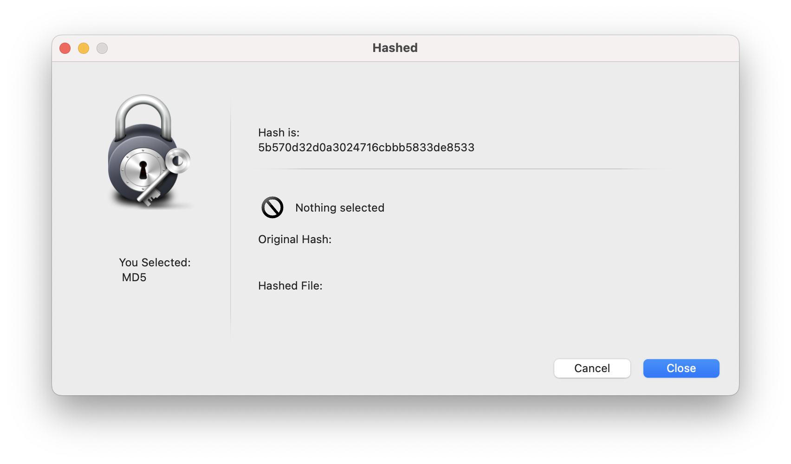

## Generate or Compare Files Hashes

#### Usage:
Use Hashed.app to generate a file hash for MD5 

You can also use Hashed.app to verify the hash of a file you have downloaded. Type or paste the hash into the "Compare hashes" field, then use the "File To Compare" field to select the file that was downloaded.

> *Hashed.app does not hash folders or directories, only individual files. If you want to hash a directory, zip the entire directory and hash the zip file.

---
## Hash a single file

---
## Compare a hash to a file

Enter orginal hash and select a file you want to compare the hash to:

If the hashes match:

If the hashes do not match:

